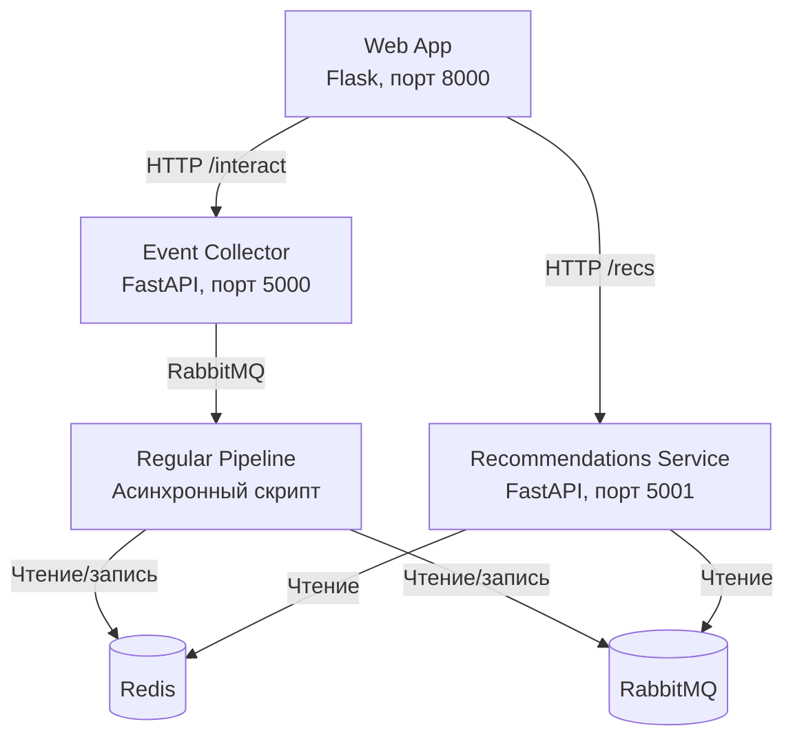

# Сервис рекомендаций фильмов и сериалов

Рекомендательная система для фильмов и сериалов, построенная на комбинации контентных признаков и данных о пользовательских предпочтениях (лайках/дизлайках). Проект реализован в рамках финального задания курса по рекомендательным системам Karpov Courses HardML.

## Архитектура

Система состоит из четырёх микросервисов, взаимодействующих через брокер сообщений RabbitMQ и базу данных Redis:



### Компоненты

#### 1. Recommendations Service (`recommendations/`)

Бекенд-сервис на **FastAPI**, отвечающий за выдачу персонализированных рекомендаций конечным пользователям.

**Эндпоинты:**

| Метод | Путь | Описание |
|-------|------|----------|
| `GET` | `/healthcheck` | Проверка статуса сервиса (возвращает `200 OK`) |
| `GET` | `/cleanup` | Сброс состояния: очищает Redis и список известных `item_id` |
| `POST` | `/add_items` | Добавление новых объектов рекомендаций в систему |
| `GET` | `/recs/{user_id}` | Получение списка рекомендаций для пользователя |

**Логика рекомендаций (`/recs/{user_id}`):**

1. **Холодный пользователь** (нет истории взаимодействий) — возвращаются **топ-10 популярных** фильмов из Redis (ключ `top_items`).
2. **Пользователь с историей** — из Redis загружаются персональные рекомендации, полученные алгоритмом ALS (ключ `{user_id}_als_items`). Из списка исключаются уже просмотренные фильмы (через `WatchedFilter`).
3. **Epsilon-жадная стратегия** — с вероятностью 5% (ε = 0.05) в рекомендации добавляются случайные фильмы для исследования новых интересов пользователя.

#### 2. Event Collector (`event_collector/`)

Сервис сбора обратной связи от пользователей на **FastAPI**. Принимает события лайков/дизлайков и передаёт их в очередь RabbitMQ для дальнейшей обработки.

**Эндпоинты:**

| Метод | Путь | Описание |
|-------|------|----------|
| `GET` | `/healthcheck` | Проверка статуса сервиса |
| `POST` | `/interact` | Приём события взаимодействия пользователя |

**Формат запроса `/interact`:**

```json
{
  "user_id": "uuid-пользователя",
  "item_ids": ["movie_1", "movie_2"],
  "actions": ["like", "dislike"],
  "timestamp": 1696000000.0
}
```

При получении события сервис:
1. Публикует сообщение в RabbitMQ (exchange `user.interact`, routing key `user.interact.message`).
2. Сохраняет факт взаимодействия в Redis через `WatchedFilter` (чтобы не рекомендовать уже просмотренные фильмы).

#### 3. Regular Pipeline (`regular_pipeline/`)

Асинхронный скрипт на Python, выполняющий роль планировщика задач (аналог Airflow/Luigi). Работает в бесконечном цикле и выполняет две ключевые задачи:

**Сбор событий (`collect_messages`):**
- Подключается к очереди RabbitMQ `user_interactions`.
- Каждые 10 секунд сохраняет накопленные события в CSV-файл (`data/interactions.csv`).

**Расчёт рекомендаций (`calculate_recommendations`):**
- Запускается каждые 10 секунд.
- **Top recommendations** — вычисляет топ-100 фильмов по количеству лайков и сохраняет в Redis (ключ `top_items`).
- **ALS рекомендации** — строит матрицу взаимодействий пользователь-товар и обучает модель **Alternating Least Squares** (ALS) из библиотеки `implicit`. Персональные рекомендации для каждого пользователя сохраняются в Redis (ключ `{user_id}_als_items`).

**Компоненты пайплайна:**

- `DataPreprocessor` — подготавливает данные: маппинг ID пользователей/товаров, создание разреженной матрицы взаимодействий.
- `ALSRecommender` — обёртка над `implicit.ALS`, обучение и генерация рекомендаций.
- `ModelEvaluator` — оценка качества по метрике **HitRate@k**.
- `HyperparameterOptimizer` — опциональная оптимизация гиперпараметров ALS через **Optuna** (закомментирована в текущей версии).

#### 4. Web App (`webapp/`)

Веб-интерфейс на **Flask** для демонстрации работы рекомендательной системы.

**Функциональность:**
- Генерация уникального `user_id` для каждого нового посетителя (через cookies).
- Отображение топ-12 рекомендованных фильмов с постерами и ссылками на IMDb.
- Кнопки **Like** и **Dislike** для каждого фильма — отправляют обратную связь в Event Collector.
- При запуске автоматически загружает все доступные фильмы в Recommendations Service через `/add_items`.

### Инфраструктура

| Компонент | Назначение |
|-----------|------------|
| **RabbitMQ** | Брокер сообщений для передачи событий взаимодействия от Event Collector к Regular Pipeline |
| **Redis** | Хранилище данных: топ-популярные фильмы, персональные ALS-рекомендации, фильтр просмотренных |
| **Docker Compose** | Оркестрация всех сервисов |

### Модели данных

**`models.py`:**

- `RecommendationsResponse` — ответ с рекомендациями (список `item_ids`).
- `InteractEvent` — событие взаимодействия пользователя (`user_id`, `item_ids`, `actions`, `timestamp`).
- `NewItemsEvent` — запрос на добавление новых объектов (`item_ids`).

**`watched_filter.py`:**

- `WatchedFilter` — утилита для хранения в Redis фактов просмотра фильмов пользователями. Используется для исключения уже показанных фильмов из рекомендаций.

### Запуск проекта

```bash
# Запуск всех сервисов
docker-compose up --build

# Сервисы будут доступны на портах:
# - Web App: http://localhost:8000
# - Recommendations Service: http://localhost:5001
# - Event Collector: http://localhost:5000
# - RabbitMQ Management: http://localhost:15672
# - Redis: localhost:6379
```

### Технологический стек

- **Язык:** Python 3.11
- **Веб-фреймворки:** FastAPI, Flask
- **Рекомендации:** implicit (ALS), scipy, numpy
- **Данные:** polars, pandas-совместимые форматы
- **Брокер сообщений:** RabbitMQ (aio-pika)
- **Кэш/БД:** Redis (redis-py)
- **Оптимизация:** optuna
- **Инфраструктура:** Docker, Docker Compose
- **Тестирование:** pytest

### Структура проекта

```
├── docker-compose.yml          # Оркестрация сервисов
├── models.py                   # Pydantic-модели данных
├── watched_filter.py           # Фильтр просмотренных фильмов
├── recommendations/            # Сервис рекомендаций
│   ├── Dockerfile
│   ├── main.py                 # FastAPI приложение
│   └── requirements.txt
├── event_collector/            # Сборщик событий
│   ├── Dockerfile
│   ├── main.py                 # FastAPI приложение
│   └── requirements.txt
├── regular_pipeline/           # Пайплайн обучения
│   ├── Dockerfile
│   ├── main.py                 # Асинхронный скрипт
│   ├── requirements.txt
│   └── data/                   # Директория для хранения взаимодействий
└── webapp/                     # Веб-интерфейс
    ├── Dockerfile
    ├── app.py                  # Flask приложение
    ├── requirements.txt
    ├── static/
    │   ├── links.csv           # Связки movieId -> IMDb ID
    │   └── movies.csv          # Данные о фильмах
    └── templates/
        └── index.html          # Шаблон главной страницы